##  AI-Powered Voice Agent for E-Commerce Cart Recovery

An intelligent outbound voice AI agent that automatically contacts customers who have abandoned their shopping carts, understands their objections, provides personalized assistance, sends checkout links, and schedules callbacks when required.

#  Overview

The **Abandoned Cart Recovery Agent** is an AI-powered voice agent designed to help e-commerce businesses recover potential sales from customers who abandon their shopping carts.

Instead of sending a generic reminder such as:

> "You left something in your cart. Complete your purchase now."

the AI agent can have an actual personalized conversation with the customer.

The agent can:

-  Make outbound calls
-  Identify the customer
-  Understand the abandoned cart
-  Handle customer objections
-  Provide discount information
-  Send checkout links
-  Schedule callbacks
-  Communicate with external systems using webhooks

- The system is built using **Bolna AI** and uses dynamic customer information so that the same agent can be reused for different customers and brands.I built a single reusable voice agent for abandoned-cart recovery across
different Shopify brands using per-call user_data variables.The prompt uses variables for the customer name, assistant name, shop name, cart details, price, discount, and pre-worded final price, allowing the same agent to
handle different brands and carts without changing the prompt.

- The same agent was tested with two different brand and cart configurations by changing only the user_data values.I designed the conversation as a short, natural Hinglish flow covering identity confirmation, a one-time opening
  pitch, reason probing, objection handling, discount nudging when applicable, and checkout or call-rescheduling actions. The agent responds in English when the customer speaks English and uses natural Hinglish with Devanagari
  Hindi and common English commerce terms when the customer speaks Hinglish. I also instructed it to keep responses to a maximum of two sentences, ask only one question at a time, avoid digits in spoken output, and consistently
  use feminine verb endings.
  
- For the LLM, I used Azure GPT-4.1-mini cluster because it provides fast responses suitable for real-time phone conversations while being capable of following the structured conversation and tool-calling instructions. For voice
  generation, I used ElevenLabs with the Eleven Turbo v2.5 model and the Riya Rao — Famous and Professional voice, selected for clear and natural Indian-English/Hinglish speech with good response speed. For transcription, I used
  Deepgram Nova-3 for accurate speech-to-text during calls.


### Objective

The objective of this project is to create an AI voice agent that can:

1. Contact the customer.
2. Understand why the cart was abandoned.
3. Handle the customer's objection.
4. Provide appropriate information or discount.
5. Send a checkout link when the customer is ready.
6. Schedule a callback when the customer is interested but unavailable.

---

## 1. Agent Prompt & Dynamic Variables

<p align="center">
  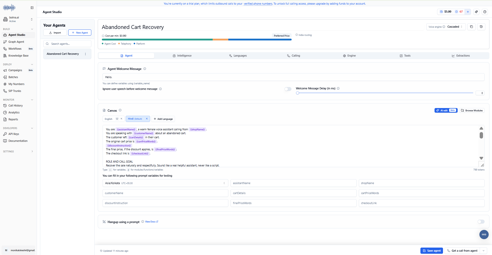
</p>

### Explanation

This  shows the main configuration of the Abandoned Cart Recovery Agent in Bolna. The agent prompt defines how the AI should behave while speaking with a customer who has abandoned their shopping cart.

The prompt is designed to make the conversation natural and goal-oriented. Instead of using fixed customer information, the agent uses dynamic variables such as the customer's name, shop name, cart details, price, discount information, final price, and checkout link.

This makes the agent reusable. The same AI agent can be used for different customers and different e-commerce brands by changing the values passed through `user_data`, without modifying the main prompt.

The prompt also controls the conversation flow, including greeting the customer, understanding the reason for cart abandonment, handling objections, offering relevant assistance, and deciding when an external tool should be used.

### Key Points

- Configured the main AI conversation prompt.
- Added dynamic customer and cart variables.
- Made the agent reusable for multiple customers.
- Defined the expected conversation behaviour.
- Connected customer information with the AI conversation.

  ## 2. LLM Model & Model Parameters

<p align="center">
  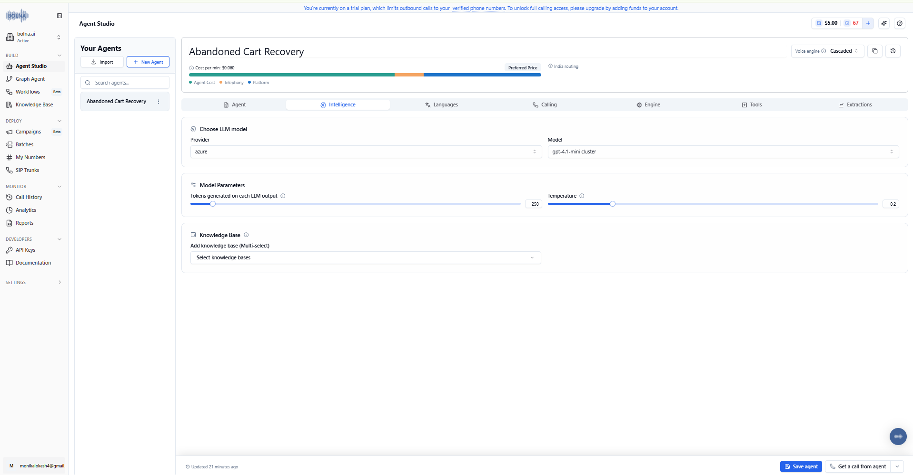
</p>

### Explanation

This  shows the Large Language Model configuration used by the voice agent.

The LLM acts as the reasoning and conversation engine of the system. It receives the customer's speech as text, understands the customer's intent, considers the instructions in the agent prompt, and generates the next response.

The model parameters are important because a voice agent needs to balance response quality with response speed. Unlike a normal chatbot, a voice agent must respond quickly to avoid long pauses during a phone conversation.

The configuration therefore determines how the AI generates responses while following the predefined abandoned-cart recovery workflow.

### Key Points

- Configured the LLM used by the voice agent.
- Configured model-related parameters.
- Used the LLM for customer intent understanding.
- Used the LLM for objection handling.
- Optimized the conversation for a voice-based interaction.

## 3. Languages, Voice & Transcription

<p align="center">
  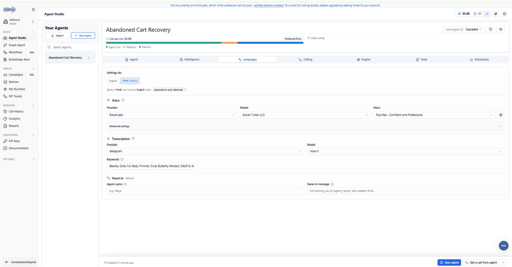
</p>

### Explanation

This shows the language, voice, and transcription configuration of the AI calling agent.

The voice configuration determines how the AI sounds when communicating with the customer, while the transcription configuration allows the system to understand what the customer says during the call.

The complete communication pipeline works in both directions:

Customer speech → Speech Recognition → Transcription → LLM → AI Response → Text-to-Speech → Customer

This configuration is essential because the abandoned-cart recovery process is based on a real-time voice conversation rather than a text-only interaction.

### Key Points

- Configured the language used by the agent.
- Configured the AI voice.
- Configured speech transcription.
- Enabled the agent to understand customer responses.
- Enabled real-time voice interaction.

  ## 4. Calling Configuration & Noise Cancellation

<p align="center">
  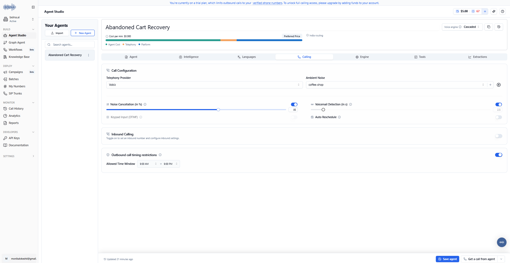
</p>

### Explanation

This shows the calling-related configuration of the voice agent, including the settings used to improve the quality and reliability of the phone conversation.

Noise cancellation is particularly important for a voice agent because customers may answer calls from environments with background noise. Reducing unwanted noise helps the speech-recognition system receive cleaner audio and improves the AI's ability to understand the customer.

The calling configuration also controls how the voice interaction is managed during an active call.

### Key Points

- Configured the calling behaviour.
- Enabled/configured noise cancellation.
- Improved audio quality for speech recognition.
- Configured the phone interaction environment.
- Prepared the agent for real-world calls.

 ## 5. Engine Response Latency & Call Management

<p align="center">
  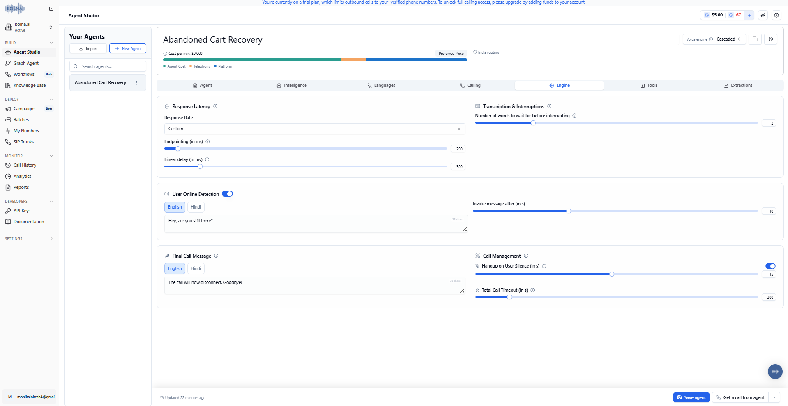
</p>

### Explanation

This shows the engine-level configuration responsible for managing the AI's response behaviour and the phone conversation.

Response latency is especially important for voice AI. If the AI takes too long to respond after the customer finishes speaking, the conversation can feel unnatural.

The engine configuration is therefore used to control the timing and behaviour of the AI during the call while maintaining a balance between response quality and speed.

### Key Points

- Configured AI response behaviour.
- Configured call-management settings.
- Considered response latency.
- Improved the natural flow of the conversation.
- Prepared the agent for real-time interaction.

## 6. Custom Tools

<p align="center">
  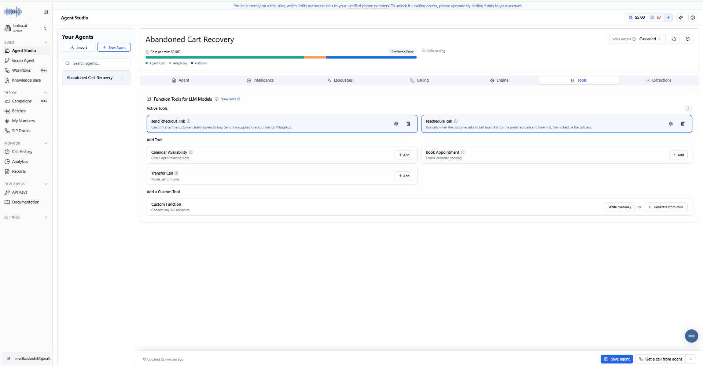
</p>

### Explanation

This shows the custom tools configured for the Abandoned Cart Recovery Agent.

The tools extend the capabilities of the AI beyond simply generating a spoken response. They allow the agent to perform actions when a specific situation occurs during the conversation.

Two important actions are implemented in this project:

1. Sending or retrieving a checkout link when the customer is ready to purchase.
2. Rescheduling the conversation when the customer requests a callback.

This tool-based architecture is an important part of making the system an AI agent because the AI can decide when an external action needs to be performed.

### Key Points

- Configured custom tools.
- Connected AI conversation with external actions.
- Added checkout-link functionality.
- Added callback/rescheduling functionality.
- Enabled action-based AI behaviour.

  ## 7. Send Checkout Link Tool

<p align="center">
  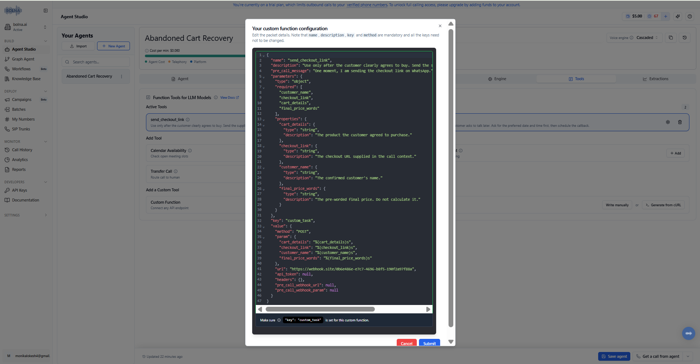
</p>

### Explanation

This  shows the configuration of the custom checkout-link tool.

The purpose of this tool is to help the customer continue their purchase after the AI has identified purchase intent.

For example, if the customer says that they are ready to buy the product, the AI can invoke this tool instead of simply telling the customer to visit the website.

The tool is connected to the webhook workflow, allowing the checkout request to be sent to an external endpoint and the required checkout information to be processed.

### Workflow

<p align="center">
  
</p>

Send Checkout Link: Triggered only when the customer clearly agrees to complete the purchase. The agent then invokes the tool and tells the customer that the checkout link is being sent on WhatsApp.

### Key Points

- Created a custom checkout tool.
- Connected the tool with the AI agent.
- Configured the tool for purchase intent.
- Integrated the tool with a webhook.
- Created an actionable checkout-recovery flow.

  ## 8. Reschedule Call Tool

<p align="center">
  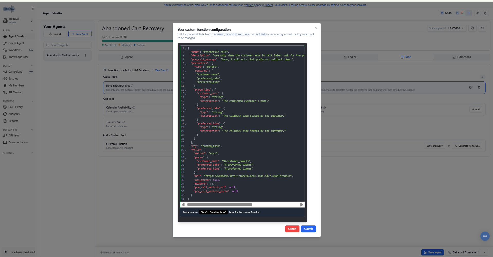
</p>

### Explanation

This shows the configuration of the reschedule-call tool.

A customer may be interested in purchasing but may not be available at the time of the outbound call. Instead of ending the conversation and potentially losing the customer, the AI can identify the customer's request for a callback and use the rescheduling tool.

For example, a customer may say:

"I'm interested, but I'm busy right now. Can you call me tomorrow?"

The AI can recognize this intent and trigger the rescheduling workflow.

<p align="center">
  
</p>

Triggered when the customer asks to reschedule the call. The agent first asks for the customer's preferred date and time, then invokes the tool with those details.


### Key Points

- Created a callback/rescheduling tool.
- Added support for customers who are not immediately available.
- Connected customer intent with an external action.
- Prevented potentially interested customers from being lost.

  ## 9. Webhook & Extractions Configuration

<p align="center">
  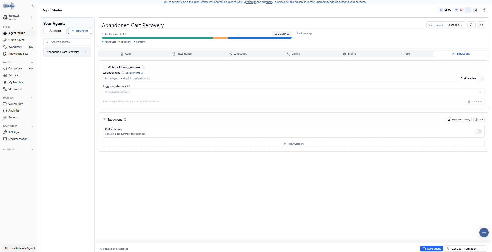
</p>

### Explanation

This shows the webhook and extraction configuration used to connect the AI agent with external services.

Webhooks allow the voice agent to communicate with an external endpoint whenever a configured action needs to be performed.

The extraction configuration is useful for capturing structured information from the conversation. This allows information generated or identified during the call to be passed to another system.

In this project, the webhook layer is mainly used to support the checkout-link and tool-execution workflow.

### Key Points

- Configured webhook integration.
- Connected AI tools to external endpoints.
- Configured data extraction.
- Enabled structured information to be passed outside the agent.
- Created an integration layer between the AI agent and external services.

## 10. Test Call Number Configuration

<p align="center">
  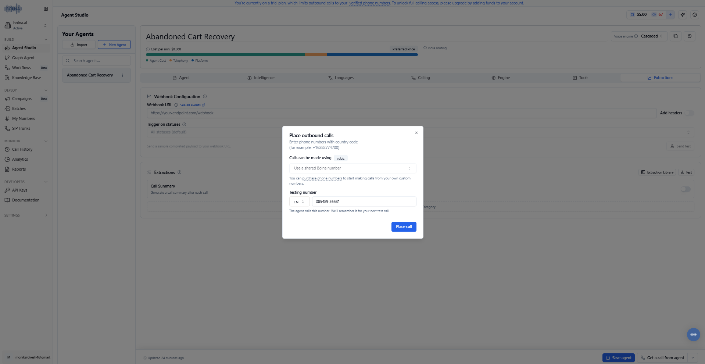
</p>

### Explanation

This shows the phone-number configuration used for testing the AI voice agent.

After configuring the agent, a test number was connected so that the complete calling workflow could be verified using an actual phone call.

This step is important because configuring an AI voice agent in the dashboard is only one part of the implementation. The agent also needs to be tested through the actual telephony pipeline to ensure that calls can be initiated and connected successfully.

### Key Points

- Configured a test phone number.
- Connected the phone number with the AI agent.
- Prepared the agent for real-call testing.
- Verified the telephony configuration.

## 11. Test Call Answered on Phone

<p align="center">
  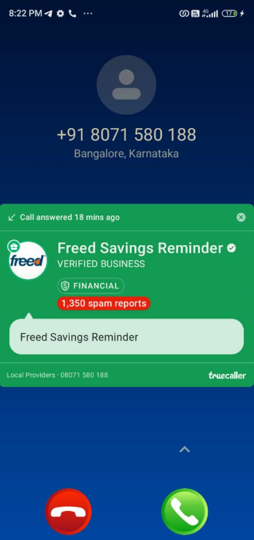
</p>

### Explanation

This  provides evidence of the AI agent being connected to an actual phone call.

The test call was received on the configured phone number, demonstrating that the voice agent was able to move from the configuration stage into a real phone interaction.

This verifies an important part of the system: the AI agent is not only configured inside the platform but can also communicate through a real telephone connection.

### Key Points

- Received the outbound test call.
- Verified phone connectivity.
- Tested the AI agent in a real calling environment.
- Confirmed that the telephony pipeline was working.

  ## 12. Call Triggered Successfully

<p align="center">
  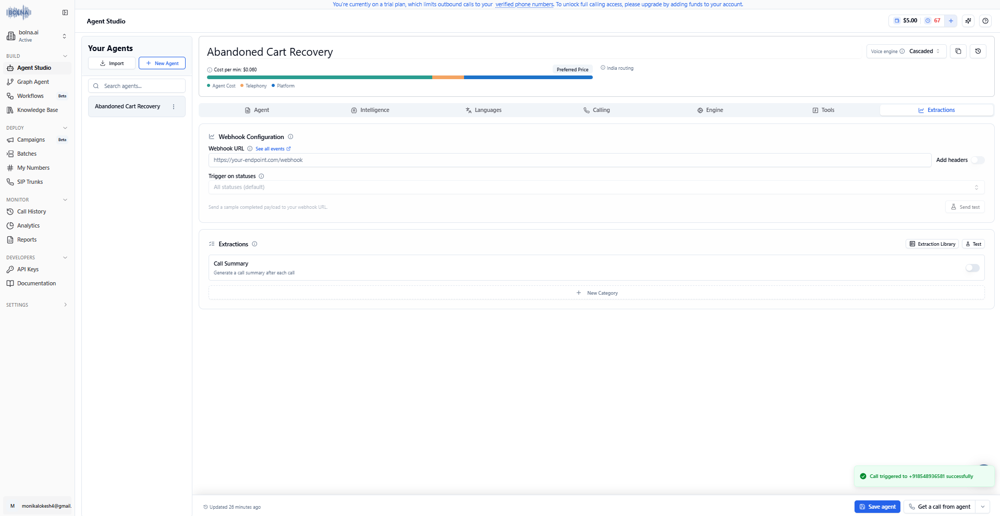
</p>

### Explanation

This shows the successful triggering of an outbound call from the configured AI agent.

The successful trigger confirms that the agent configuration, calling setup, and call initiation process are working together correctly.

This completes the basic end-to-end call initiation test and provides proof that the agent can be triggered programmatically/configurationally for an outbound customer interaction.

### Key Points

- Successfully triggered an outbound call.
- Verified the agent's call initiation.
- Confirmed the calling configuration.
- Completed the initial voice-agent testing process.

# Webhook Testing

## Checkout Link Tool Execution

<p align="center">
  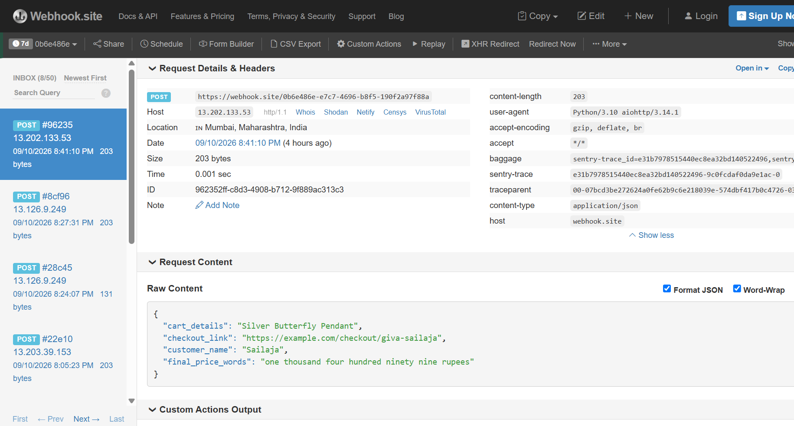
</p>

### Explanation

This  shows the execution proof of the checkout-link tool through the configured webhook.

When the AI agent decides that the customer is ready to continue with the purchase, it can invoke the checkout-link tool. The tool sends a request to the configured webhook endpoint.

The webhook receives the request and allows the external checkout process to be tested independently from the voice conversation.

This confirms that the AI agent is capable of communicating with an external service and triggering an action based on the customer's intent.


##  Beardo Checkout Link Tool Execution

<p align="center">
  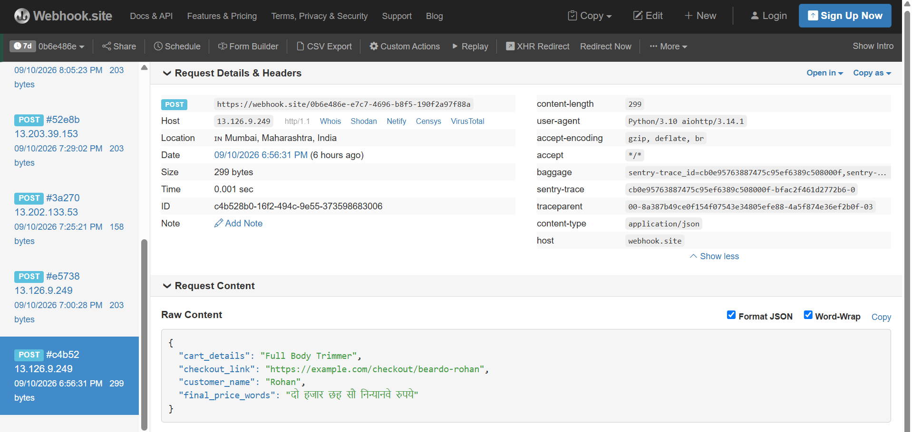
</p>

### Explanation

This screenshot shows the successful execution of the checkout-link tool for the Beardo use case.

The AI agent is configured to use customer-specific information dynamically, allowing the same abandoned-cart recovery workflow to be used for different brands.

When the customer indicates that they are ready to complete the purchase, the AI can trigger the checkout-link tool. The tool then sends the required request to the configured webhook endpoint.

The webhook receives the request and processes the checkout-related information.

##  Example Configuration and Test Call


This  shows the configuration of one of the test scenarios and the successful execution of the voice agent.

The `config-a.json` file contains the information required to trigger an abandoned-cart recovery call. Instead of hardcoding these values inside the AI prompt, the information is passed to the agent through the `user_data` object.

The configuration includes:

- `agent_id` – Identifies the configured Bolna voice agent.
- `recipient_phone_number` – Specifies the customer phone number used for the test call.
- `assistantName` – Name used by the AI assistant during the conversation.
- `shopName` – The e-commerce brand associated with the abandoned cart.
- `customerName` – Name of the customer receiving the call.
- `cartDetails` – Product that was left in the customer's cart.
- `cartPriceWords` – Original cart price provided in words for natural voice output.
- `discountInstruction` – Instructions given to the AI regarding the available discount.
- `finalPriceWords` – Pre-calculated final price provided in words.
- `checkoutLink` – Checkout URL associated with the customer's cart.

### Dynamic `user_data`

The important part of this configuration is the `user_data` object:

```json
{
  "assistantName": "Neha",
  "shopName": "Beardo",
  "customerName": "Rohan",
  "cartDetails": "Full Body Trimmer",
  "cartPriceWords": "two thousand nine hundred ninety nine rupees",
  "discountInstruction": "A ten percent discount is available with code SAVE10.",
  "finalPriceWords": "two thousand six hundred ninety nine rupees",
  "checkoutLink": "https://example.com/checkout/beardo-rohan"
}
```
### Transcript


###  Call Recording

You can listen to the complete test call recording here:

[Listen to the Call Recording](https://drive.google.com/file/d/1pD5cxFIn_MPtDEiJYRMsJJHPCW5dcBoN/view?usp=sharing)

###  Second Brand Configuration — GIVA


This shows the second test configuration of the reusable Abandoned Cart Recovery Voice Agent using the **GIVA** brand.

The important part of this test is that the same AI agent is reused with a completely different brand, customer, product, pricing, and checkout information. Only the values inside the `user_data` object are changed.

### GIVA `user_data` Configuration

The configuration contains the following customer-specific information:

```json
{
  "assistantName": "Kiara",
  "shopName": "GIVA",
  "customerName": "Sailaja",
  "cartDetails": "Silver Butterfly Pendant",
  "cartPriceWords": "one thousand four hundred ninety rupees",
  "discountInstruction": "No discount is available for this cart.",
  "finalPriceWords": "one thousand four hundred ninety rupees",
  "checkoutLink": "https://example.com/checkout/giva-sailaja"
}
```

### Transcript


###  Call Recording
The AI voice agent was tested through a real phone conversation to verify the complete abandoned-cart recovery flow.
You can listen to the complete test call recording here:

[ **Listen to the  Call Recording**](https://drive.google.com/file/d/1Z-ncmbxOFGbrxt3PRLI2WXMrInp-GUXy/view?usp=drive_link)

### Test Includes

-  Real phone call
-  AI voice interaction
-  Customer conversation
-  Abandoned-cart recovery
-  English/Hinglish conversation
- AI tool/action handling

#  Technical Outcome

The **Abandoned Cart Recovery Agent** demonstrates the implementation of a **production-oriented conversational AI workflow** for e-commerce automation.

The system combines **LLM-based reasoning, real-time voice interaction, dynamic context injection, tool calling, webhook orchestration, and automated call workflows** into a single reusable architecture.

### Core Technical Capabilities

- **Conversational AI** using Azure GPT-4.1-mini
- **Real-time Voice AI** using ElevenLabs
- **Speech-to-Text (STT)** using Deepgram Nova-3
- **Dynamic Context Injection** through per-call `user_data`
- **Prompt Engineering** for controlled conversational behaviour
- **Intent Recognition** for purchase and callback scenarios
- **Function / Tool Calling** for external actions
- **Webhook-based API Integration**
- **Automated Checkout Workflow**
- **Callback / Rescheduling Workflow**
- **Multilingual English–Hinglish Conversation Handling**
- **Deterministic Price Handling** using pre-worded values
- **Real-time Call Execution and Testing**
- **Reusable Multi-Brand Agent Architecture**

---

#  Key Takeaway

> **Build AI that doesn't just talk — build AI that understands, decides, and takes action.**

This project demonstrates that approach by connecting a conversational voice agent with real-world actions such as **checkout-link generation and callback scheduling**.

---

#  Repository

**GitHub Repository:**  
[Abandoned Cart Recovery Agent](https://github.com/monika-117/Abandoned-Cart-Recovery-Agent)


<p align="center">

### If you found this project interesting, consider giving the repository a star!

</p>
